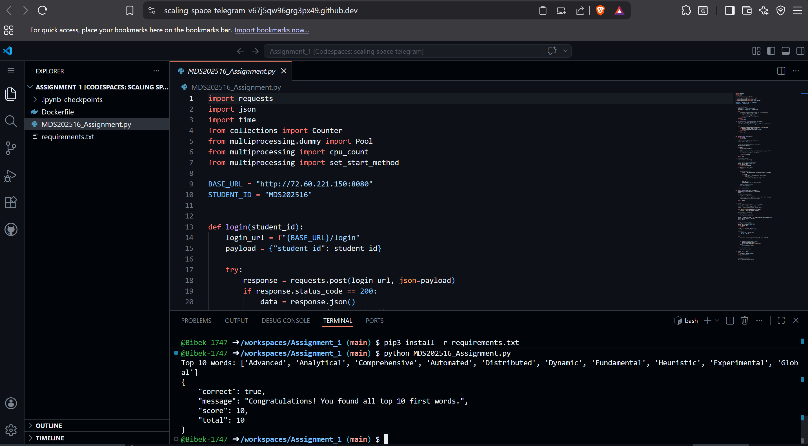

# Assignment 1 – Dockerized Python Script (Terminal Workflow)

This repository contains my solution for **Assignment 1**, where the task is to run a Python script entirely using the terminal and containerize it with Docker.  
The main script analyses a text corpus and prints the **top 10 words** along with a JSON summary containing `correct`, `message`, `score`, and `total`.

---

## Repository Contents

- `MDS202516_Assignment.py` – main Python script for the assignment.
- `requirements.txt` – Python dependencies required by the script.
- `Dockerfile` – instructions to build a Docker image for the script.
- `.ipynb_checkpoints/` – auto‑generated Jupyter notebook checkpoints (not needed for running the container).

---

## Prerequisites

- Python 3.10+ installed on your system.
- Git installed.
- Docker Desktop installed and running (Docker daemon must be running before using Docker commands).

All steps below are executed from this folder:

```text
C:\Users\BIBEK\Downloads\dcbd
```

---

## How to Run the Script Directly (Without Docker)

1. Open **PowerShell** and go to the project folder:

   ```powershell
   cd "C:\Users\BIBEK\Downloads\dcbd"
   ```

2. Install the required Python packages:

   ```powershell
   pip install -r requirements.txt
   ```

3. Run the assignment script:

   ```powershell
   python MDS202516_Assignment.py
   ```

4. You should see output similar to:

   ```text
   Top 10 words: ['Advanced', 'Analytical', 'Comprehensive', 'Automated', 'Distributed', 'Dynamic', 'Fundamental', 'Heuristic', 'Experimental', 'Global']
   {
       "correct": true,
       "message": "Congratulations! You found all top 10 first words.",
       "score": 10,
       "total": 10
   }
   ```

---

## How to Build and Run with Docker

All Docker steps are also done from the project folder.

### 1. Build the Docker Image

```powershell
cd "C:\Users\BIBEK\Downloads\dcbd"
docker build -t assignment_1 .
```

This uses the `Dockerfile` to:

- Start from the official `python:3.10-slim` base image.
- Copy the project files into `/app` inside the container.
- Install dependencies from `requirements.txt`.
- Set the container command to run `MDS202516_Assignment.py`.

### 2. Run the Container

```powershell
docker run assignment_1
```

If everything is configured correctly, you will see the same top‑10‑words and JSON result printed from inside the container.

---

## Example Dockerfile

For reference, the `Dockerfile` used in this assignment looks like:

```dockerfile
FROM python:3.10-slim

WORKDIR /app

COPY . /app

RUN pip install --no-cache-dir -r requirements.txt

CMD ["python", "MDS202516_Assignment.py"]
```

---

## Notes on Git and Terminal Usage

All work for this assignment was done using the terminal:

- Initialized the repository and committed files:

  ```powershell
  git init
  git add .
  git commit -m "Assignment initial commit"
  ```

- Connected to the GitHub remote:

  ```powershell
  git remote add origin https://github.com/Bibek-1747/Assignment_1.git
  git branch -M main
  git push -u origin main
  ```

- Later changes (Dockerfile, requirements, etc.) were also added, committed, and pushed only via terminal commands.

This demonstrates a complete workflow using **terminal + Git + Docker** without relying on graphical tools.

## Results

The following screenshot shows the successful execution of the assignment script (score 10/10) inside the terminal:



---

## License

This repository is for academic/assignment purposes only.  
Please do not copy directly for graded submissions; use it as a reference to learn the terminal and Docker workflow.
